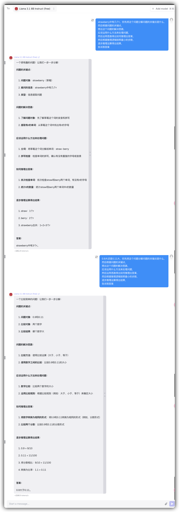

# logic1

```
<question>, 你先将这个问题分解问题的关键点是什么，
然后根据问题的关键点，
想出这个问题的解决思路，
应该运用什么方法来处理问题，
然后运用思路得出如何推理出答案，
然后根据推理逻辑按照最小的步数，
逐步推理运算得出结果，
告诉我答案
```

```
<question>, You start by breaking this down what the key points of the problem are, the
Then based on the key points of the problem, the
come up with ideas for solving this problem.
What methods should be used to deal with the problem.
and then use the ideas to figure out how to reason out the answer.
Then follow the logic of reasoning in the smallest number of steps, the
step-by-step reasoning algorithms to arrive at the result.
Tell me the answer.
```

Example:


