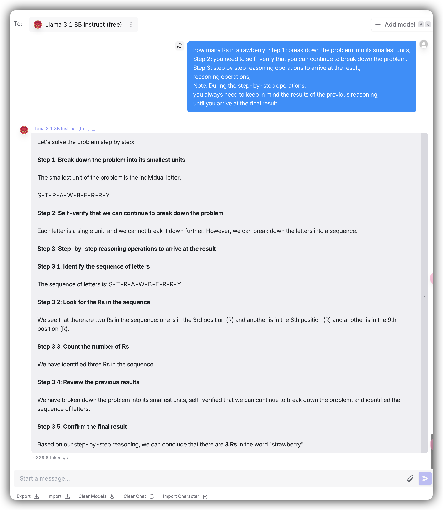
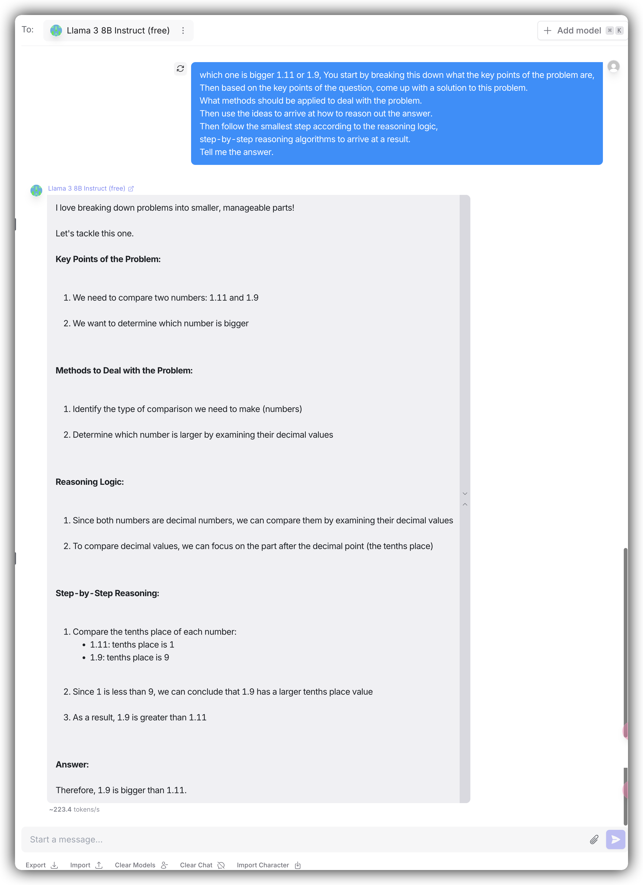
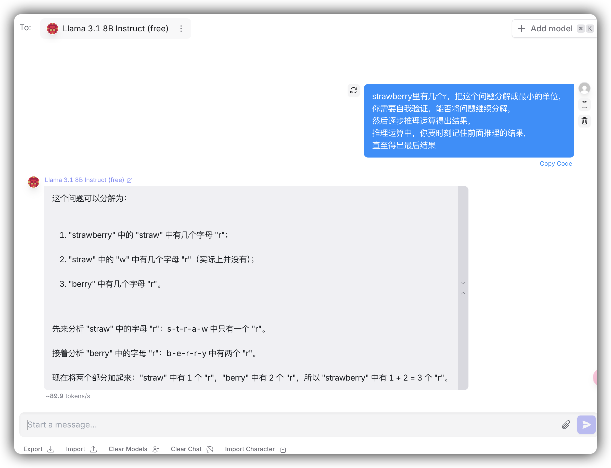
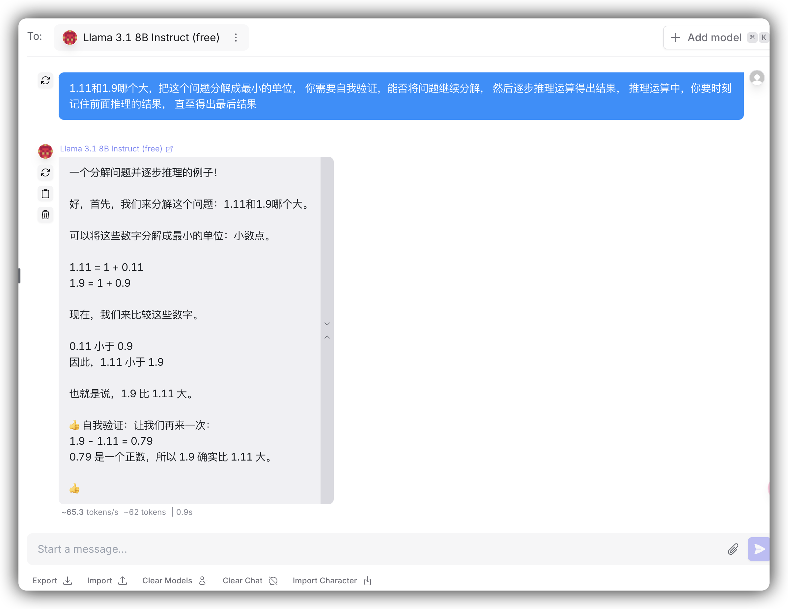

# logic1

```
<question>, 首先把这个问题分解成最小的单位，
你需要自我验证，能否将问题继续分解，
然后逐步推理运算得出结果，
推理运算中，你要时刻记住前面推理的结果，
直至得出最后结果
```

```
<question>, Step 1: break down the problem into its smallest units,
Step 2: you need to self-verify that you can continue to break down the problem.
Step 3: step by step reasoning operations to arrive at the result,
reasoning operations,
Note: During the step-by-step operations,
you always need to keep in mind the results of the previous reasoning,
until you arrive at the final result
```

Example:

Strawberry:



Float compare:



In Chinese:

Pretty good in understand worlds



Math problem is not stable


